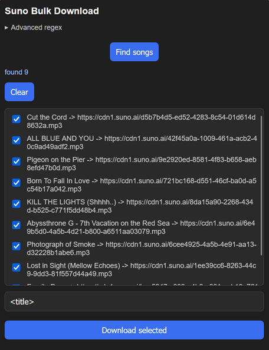

# Suno Bulk Download

Browser extension that scans a Suno page for song links and lets you bulk-download the tracks you select.

## Features

- Scans the current tab for Suno song links (regex-based, customizable/resettable)
- Select individual tracks or toggle select all
- Custom output filename template (e.g. `<title>`)
- Download all checked tracks at once

## Install (unpacked)

1. Open your browser's extensions page (`about:debugging` for Firefox)
2. Enable Developer mode
3. Load unpacked / temporary add-on and select this folder

## Usage

1. Open a Suno page listing songs
2. Click the extension icon, then **Find songs**
3. Select the tracks you want
4. Scroll down and click **Find songs** to detect more
5. Click **Download selected**

## Firefox

